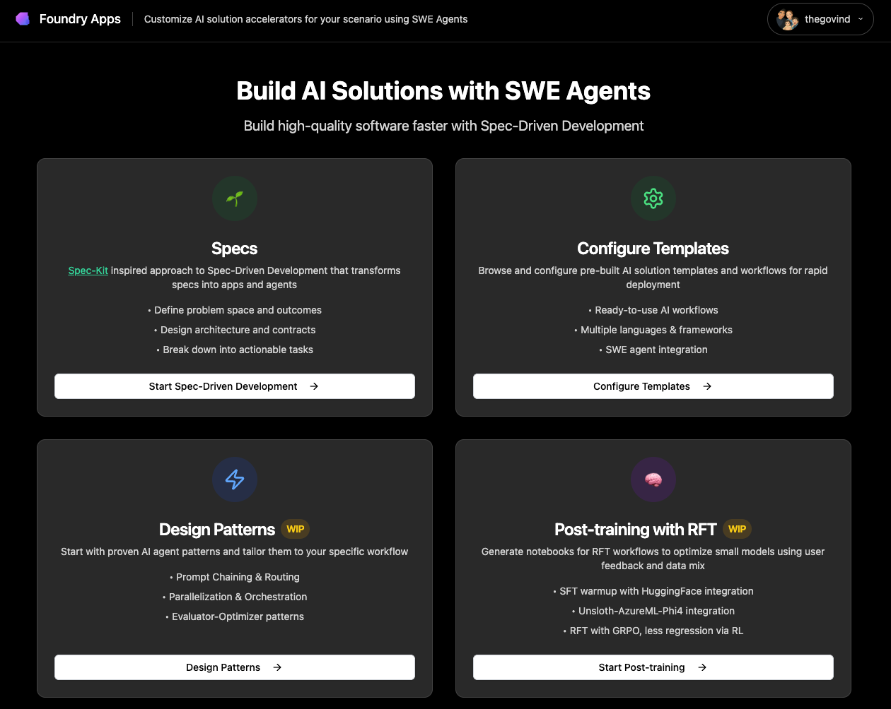
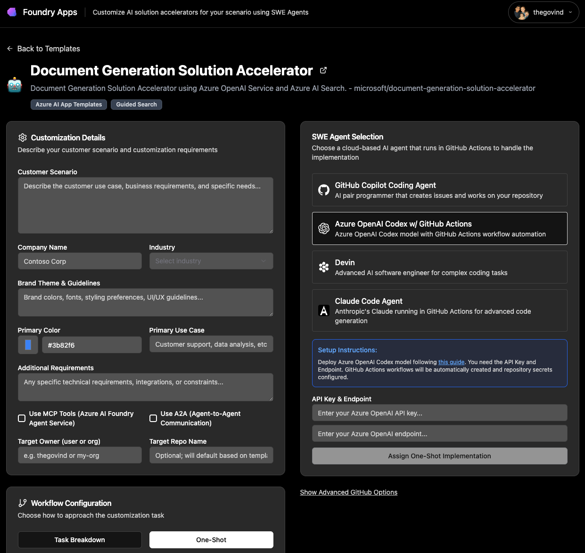
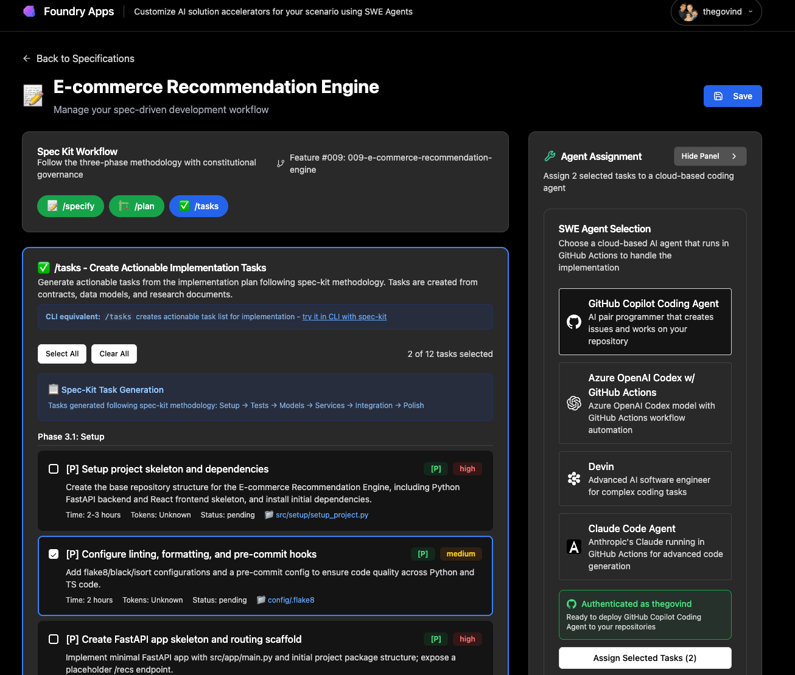
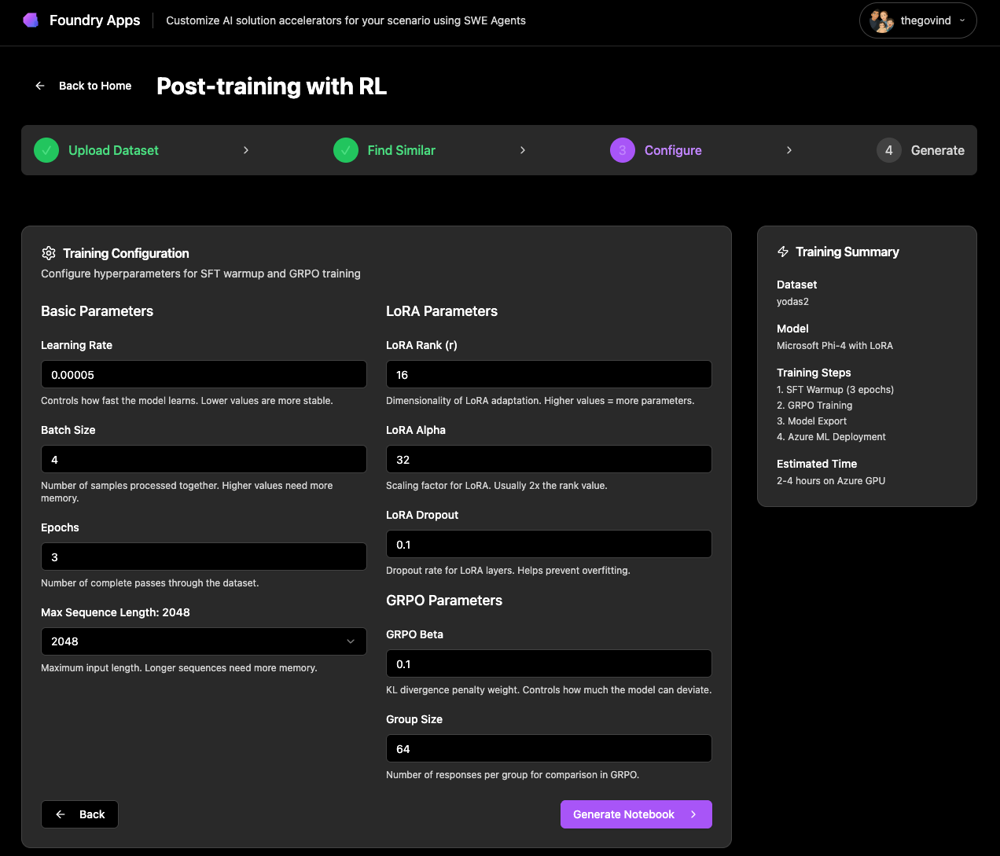

# AIfoundry.app

> **⚠️ Experimental - Work in Progress**  
> This is an experimental platform currently under active development. You can test the latest version at [aifoundry.app](https://aifoundry.app)

A platform for customizing specifications, templates, and patterns to bootstrap projects quickly with SWE agents doing the heavy lifting. If you have existing data, configure it to post-train small models.

## 🚀 Quick Start

**For the best experience, we recommend self-hosting this application to avoid rate limits and get full functionality.**

### Option 1: Self-Host (Recommended)
```bash
# Clone the repository
git clone https://github.com/Azure/aifoundry-apps.git
cd aifoundry-apps

# Run the interactive setup script
./setup.sh                    # Linux/macOS
# OR
.\setup.ps1                   # Windows PowerShell
```

### Option 2: Try the Demo
Visit [aifoundry.app](https://aifoundry.app) to try the demo (note: heavily rate-limited)

## What It Does

- **Customize Specifications**: Create detailed technical specs that guide development
- **Browse Templates**: Use pre-built AI agent templates from Azure AI Foundry
- **Design Patterns**: Create multi-agent workflows for complex tasks
- **Assign to SWE Agents**: Let GitHub Copilot and other agents do the heavy lifting
- **Post-Train Models**: Fine-tune small models with your existing data using RL

## Screenshots

See AIfoundry.app in action with these key features:

<table>
<tr>
<td width="50%">

**Homepage Interface**
<br>


</td>
<td width="50%">

**Agent Templates**
<br>


</td>
</tr>
<tr>
<td width="50%">

**Task Assignment**
<br>


</td>
<td width="50%">

**Post-Training with RL**
<br>


</td>
</tr>
</table>

## Tech Stack

- **Backend**: FastAPI + Python, inspired by [spec-kit](https://github.com/github/spec-kit)
- **Frontend**: React + TypeScript + Tailwind CSS
- **AI Integration**: Azure AI Foundry, GitHub Copilot, MCP

## 🛠️ Local Development

### Quick Start
```bash
# Clone and setup
git clone https://github.com/Azure/aifoundry-apps.git
cd aifoundry-apps
./setup.sh  # or .\setup.ps1 on Windows

# Start backend
cd src/backend
uv venv && source .venv/bin/activate
uv sync && uv run uvicorn app.main:app --host 0.0.0.0 --port 8000 --reload

# Start frontend (new terminal)
cd src/frontend
pnpm install && pnpm run dev
```

### Configuration
Create `src/backend/.env`:
```bash
# Required for AI features
AZURE_OPENAI_ENDPOINT=your_endpoint
AZURE_OPENAI_API_KEY=your_key

# Optional: GitHub integration
GITHUB_APP_ID=your_app_id
GITHUB_CLIENT_ID=your_client_id
GITHUB_CLIENT_SECRET=your_client_secret
```

## 🌐 Self-Hosting

### Docker (Easiest)
```bash
git clone https://github.com/Azure/aifoundry-apps.git
cd aifoundry-apps/deployment
docker-compose up -d
```

### Manual Setup
```bash
# Follow local development steps above
# Configure production environment variables
# Use nginx for reverse proxy and SSL
```

### Why Self-Host?
- No rate limits
- Full control over your data
- Customize as needed

## Contributing

This project is in active development. Contributions, feedback, and suggestions are welcome.

## License

This project is licensed under the MIT License - see the [LICENSE](LICENSE) file for details.